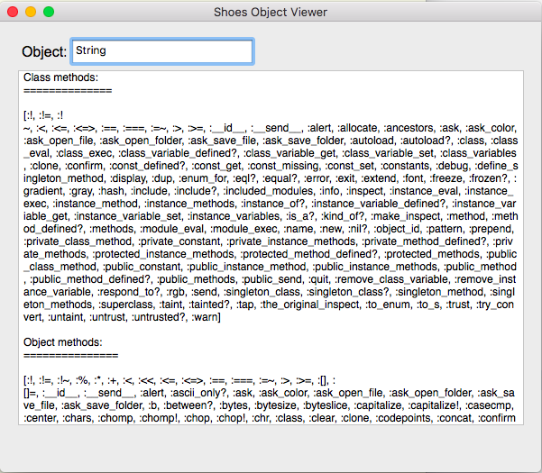

# Shoes Tutorial

## Introduction

In this assignment, we'll practice working with Ruby syntax before diving into
deeper concepts, using the Ruby Shoes graphical toolkit. Shoes is a framework
designed to help new programmers learn Ruby, by creating GUIs via an intuitive
syntax.

The goals for this assignment are:

1. Learn some basic Ruby syntax
2. Feel confident in installing and setting up programs and libraries
3. Learn how to read documentation and self-diagnose problems
4. Learn some basic Shoes syntax
5. Setup our environment for future assignments

## Setup

* Get a copy of Shoes running. It comes with it's own copy of Ruby, so you don't need to install Ruby, RVM or rbenv in order to complete this exercise. You can download ready made binaries here:

> http://shoesrb.com

There are some helpful resources online at:

> http://shoesrb.com/manual/Installing.html
> https://github.com/shoes/shoes/wiki/Building-Shoes

On OSX, if you get a command not found error, you may have to add the following line to your ~/.bash_profile:

`PATH=/Applications/Shoes.app/Contents/MacOS:$PATH`

* If you've not already done so, fork your own copy of this exercise and clone it
* Make sure you're in the right directory, using `cd shoes-tutorial`:
* Run it! Notice the `shoes` command, not the `ruby` command! You should see a window with a button inside labelled 'Push Me'.

`shoes tutorial.rb`

* Any problems, chime in on the #Ruby channel on Slack.

## TODO

1. Complete the tutorial at http://shoesrb.com/walkthrough

2. Using the information you've gathered in the tutorial, and by looking up the reference material in the [manual](http://shoesrb.com/manual/Hello.html), you're going to make a simple GUI that displays the available methods in Ruby classes. Once we're done, you'll have made something like the picture below.

3. Run the object viewer using `shoes object_viewer.rb`.

4. You should see a window with two input boxes. Type the name of a Ruby class in the box, such as `String`. You should see 'Bingo!' appear if you entered the name of a class correctly.

5. We're going to display all of the _class_ methods of the class that you entered into the edit line. We've provided the selected class in a local variable called `selected_class`. Call the `methods` method on the selected class and populate the values in the `@output` edit box.

6. See if you can sort the methods in alphabetical order.

7. See if you can do the same thing as above, but print out all the _object_ methods as well.

8. See if you can print out the number of arguments each method takes. Checkout the [arity method](https://ruby-doc.org/core-2.2.0/Method.html#method-i-arity)

9. When you're done, push your work and send us a merge request.

